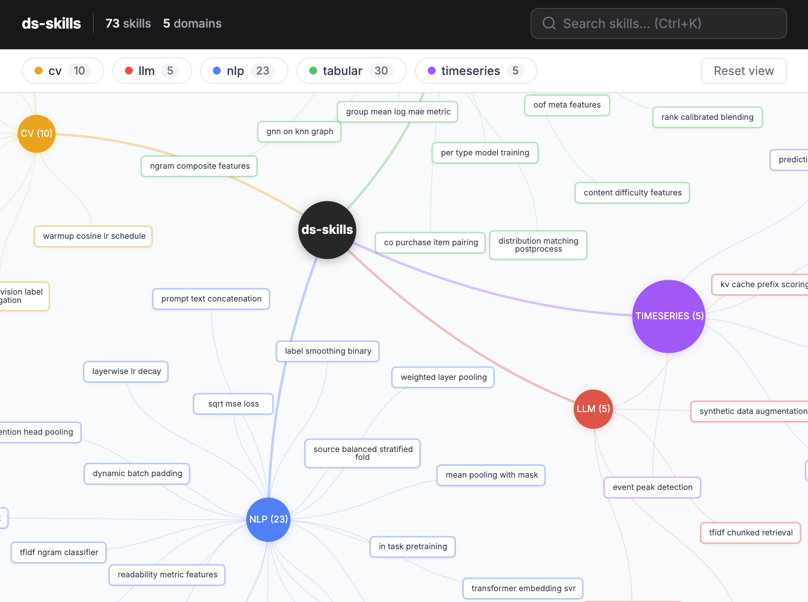

[English](README.md) | [中文](README_CN.md)



# ds-skills

从优秀 Kaggle Notebook 中提炼的数据科学技能库。

106 个可复用技巧，覆盖 5 大领域，均从高票 Kaggle 竞赛方案中提取。每个技能是一个独立的 SKILL.md —— 可直接被 Claude Code、Cursor、Codex 或任何 AI 编程助手加载使用。

> 持续更新中 —— 600+ 场竞赛待处理，自动化蒸馏 Agent 定期提取新技能。Star 本仓库以获取最新动态。

## 技能一览

| 领域 | 数量 | 示例 |
|------|------|------|
| **tabular** (表格数据) | 31 | adversarial-validation, optuna-lgbm-tuning, rank-calibrated-blending, per-feature-bias-correction |
| **nlp** (自然语言处理) | 38 | deberta-classification, layerwise-lr-decay, mbr-decoding-reranking, multi-temperature-candidate-sampling |
| **cv** (计算机视觉) | 11 | mixed-precision-training, heavy-augmentation-pipeline, separable-temporal-spectral-cnn |
| **timeseries** (时间序列) | 21 | mc-dropout-uncertainty, correlated-double-sampling, gradient-event-boundary-detection, learnable-fir-filter |
| **llm** (大语言模型) | 5 | wikipedia-rag-retrieval, kv-cache-prefix-scoring, confidence-threshold-fallback |

完整列表：运行 `scripts/skills-list` 或浏览[交互式技能图谱](graph/skills-map.html)。

## 安装技能到你的 AI 助手

<details>
<summary><b>Claude Code</b></summary>

```bash
scripts/skills-copy --dest ~/.claude/skills
```

</details>

<details>
<summary><b>Cursor</b></summary>

```bash
scripts/skills-copy --dest ~/.cursor/rules
```

</details>

<details>
<summary><b>Codex</b></summary>

```bash
scripts/skills-copy --dest ~/.codex/skills
```

</details>

复制时自动扁平化：`skills/nlp/deberta-classification/` 变为 `nlp-deberta-classification/`。

## 目录结构

```
skills/<领域>/<技巧名>/SKILL.md
```

每个 SKILL.md 包含：
- **YAML 头部** —— 名称和描述（供 Agent 自动发现）
- **概述** —— 用途和使用场景
- **快速开始** —— 最小可运行代码
- **工作流** —— 分步骤说明
- **关键决策** —— 权衡取舍与参数选择
- **参考** —— 源 Kaggle Notebook 链接

## 脚本

| 脚本 | 用途 |
|------|------|
| `scripts/skills-list` | 列出所有技能及元数据。`--json` 输出结构化数据，`--html` 重新生成技能图谱 |
| `scripts/skills-copy --dest <目录>` | 将技能扁平化复制到任意 Agent 的技能目录 |

## 数据来源

每个技能均从 [Kaggle](https://www.kaggle.com) 高票 Notebook 中提炼。每个 SKILL.md 的参考部分链接到原始 Notebook。

已处理竞赛：Playground Series S6E3、HPA 单细胞分类、Google QUEST 问答、Feedback Prize 英语学习、CommonLit 学生摘要、Kaggle LLM 科学考试、H&M 时尚推荐、CommonLit 可读性、Data Science Bowl 2019、CHAMPS 分子耦合、Child Mind Institute 睡眠检测、LLM 检测 AI 文本、RANZCR CLiP、Riiid 答题预测、NBME 临床笔记评分、Deep Past 阿卡德语翻译、CMI 传感器行为检测、NeurIPS Ariel 数据挑战赛 2024。

## 许可

MIT
